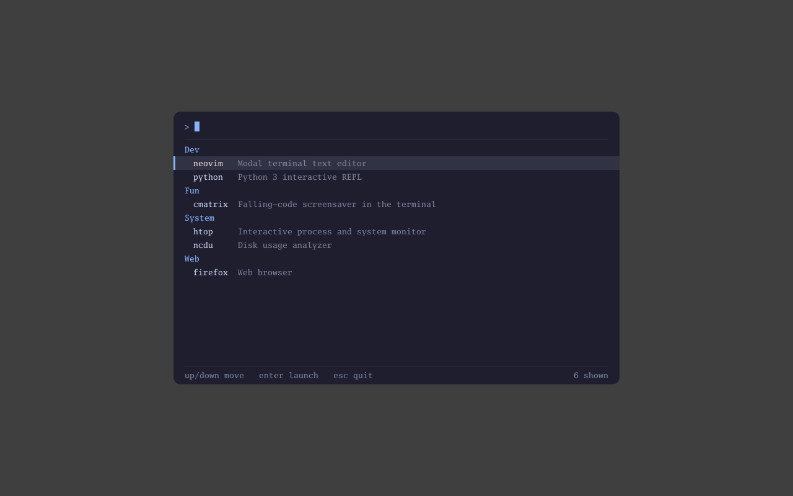

# Zinc

**Zinc** is a security-focused **sandboxing core**. It runs user-facing apps via rootless
Podman containers (primary runtime) or qemu VMs (heavy isolation), each walled off from the
rest of the desktop through the Wayland security-context protocol. Zinc is
compositor-agnostic and installs cleanly on any existing system.

**ZDE** (Zinc Desktop Environment, `zde`) is a separate project built on Zinc - the full
environment, shipped in two variants (`zde-niri` and `zde-hypr`) wired together by a Nix
home-manager flake, and developed in its own repository.

**Priority order: Stable, then Secure, then Beautiful.**

- Architecture: [`docs/architecture.md`](docs/architecture.md)
- Roadmap: [`ROADMAP.md`](ROADMAP.md) and releases: [`RELEASES.md`](RELEASES.md)
- Contributing: [`CONTRIBUTING.md`](CONTRIBUTING.md)

## Components

Every runner is `zinc-<kind>-runner`, where `<kind>` is `container` or `virtualization`,
plus the `zinc-launcher-<ui>` picker. One creator authors both app kinds, so it carries no
kind at all. The short code is the initials.

| Short | Tool                         | Role                               | Since |
|-------|------------------------------|------------------------------------|-------|
| `zc`  | `zinc-creator`               | define apps, container or VM       | 0.1   |
| `zcr` | `zinc-container-runner`      | launch + supervise a container app | 0.1   |
| `zvr` | `zinc-virtualization-runner` | launch + supervise a VM app        | 0.4   |
| `zlg` | `zinc-launcher-gui`          | fast app launcher (GUI)            | 0.3   |
| `zlt` | `zinc-launcher-tui`          | fast app launcher (TUI)            | 0.2   |

A **creator** defines an app and writes its config; a **runner** actually starts that app
and owns its lifecycle; **launchers** are quick pickers over the defined apps. They share
one library, [`common/`](common) (the app schema + validation), so container and VM apps
use the same config format.

The creator carries no runtime: `zc` authors app files and shells out to `zcr` or `zvr` to
run them, so it meets the runners only at the on-disk YAML format and never shares code
with either.

Layout: `common/` (the shared schema + validation), `creator/` (`zc`),
`container/{runner,e2e}` and `virtualization/{runner,e2e}` (the two runners and their
end-to-end suites), `launcher/{common,tui,gui}` (the shared launcher library and the
TUI/GUI pickers), and `menu/` (the reusable Wayland overlay-menu core the GUI launcher
builds on).

## Status

**0.7 - containment and sibling routing.** Both runtimes work: containers since 0.1, VMs
since 0.4 (with guest GPU in 0.5 and Windows-class guests in 0.6). Common to both: the
app-config schema and validation (including the rule that third-party images must be
digest-pinned), config inheritance, a YAML config store under `~/.config/zinc/apps`, and a
keyboard-first Bubbletea TUI.

For containers, the **fail-closed network lock-down** is applied in the app's own network
namespace before the app starts, so there is no unfiltered window:

- no network lists: the app reaches only its own localhost (isolated)
- egress list: default-drop, allow only the listed destinations - CIDRs, or `Domains`
  resolved at launch - and ports
- ingress publish: expose the app's own ports to the LAN, filtered by source
- sibling link: a private internal bridge between two apps, gated per-port
- routing (`Via`): send one list's traffic through a sibling instead of out this app's own
  egress, with fail-closed DNS. This is what putting an app behind a VPN container is made
  of: it has no other path, so it cannot leak past the sibling, and if the sibling stops the
  traffic blackholes rather than falling back
- forwarding (`Forward`, `ForwardPorts`): the sibling on the other end consents to act as a
  gateway, and bounds which ports it will carry
- tunnel (`Tunnel`): the runner builds the app's WireGuard interface from a wg-quick config
  before the app exists, so the app never holds the `CAP_NET_ADMIN` that builds it

Still rejected rather than mis-enforced: host-scoped egress, and multi-homing through an
explicit `GatewayV4` / `GatewayV6`. `Domains` is resolved once at launch, not live - a
domain whose addresses rotate drifts out of the allowed set until the app is restarted,
which fails shut rather than open.

Beyond the network, an app gets **no D-Bus session bus** unless it asks for one. The host bus
reaches the keyring, the portal, the compositor and every other service the user runs, so
handing it to a sandbox would undo most of the sandbox. `DBusMeta` names what to open - `Talk`
for names the app may call, `Own` for names it may claim - and `zcr` serves it a filtered
socket from an `xdg-dbus-proxy` container that holds the real one. That proxy is deliberately
not in the app's pod, since a shared PID namespace would let the app signal or ptrace the
process filtering it.

This is the container network model. A **VM app** does not get it - nftables in a container's
own network namespace does not reach a guest kernel - so rather than mis-enforce it, a guest
runs on user-mode networking with explicit port forwards bound to loopback, and
`NetworkMeta` on a VM app is a validation error.

## Install

Podman-only, reproducible builds. Build the binaries and put them on your `$PATH`:

```sh
make -C creator build                # produces creator/bin/zc
make -C container/runner build       # produces container/runner/bin/zcr
make -C virtualization/runner build  # produces virtualization/runner/bin/zvr  (0.4)
make -C launcher/tui build           # produces launcher/tui/bin/zlt           (0.2)
make -C launcher/gui build           # produces launcher/gui/bin/zlg           (0.3)
install -Dm755 creator/bin/zc                ~/.local/bin/zc
install -Dm755 container/runner/bin/zcr      ~/.local/bin/zcr
install -Dm755 virtualization/runner/bin/zvr ~/.local/bin/zvr
install -Dm755 launcher/tui/bin/zlt          ~/.local/bin/zlt
install -Dm755 launcher/gui/bin/zlg          ~/.local/bin/zlg
```

`zc` needs `zcr` on `$PATH` to run container apps and `zvr` to run VM apps (authoring works
without either). To run egress-filtered apps, build the nft helper image once:

```sh
make -C container/runner netfilter-image
```

## Usage

```sh
# author with zc: a bare name resolves against ~/.config/zinc/apps; a path is read directly.
# --entrypoint is worth setting: without it the app runs the image's default command, which
# for many images exits immediately.
zc new firefox --image docker.io/library/firefox@sha256:... --entrypoint firefox
zc list
zc validate firefox
zc validate firefox --resolved  # print what it actually is, with any Inherits chain merged in
zc tui                        # keyboard-first manager: create / edit / run / stop / logs

# find and pin an image (third-party images must be digest-pinned)
zc image search alpine
zc image resolve alpine:3.20  # gives docker.io/library/alpine@sha256:... to paste in

# compose interop, both ways. Lossy in both directions, and it prints exactly how:
# exporting cannot carry the egress lock-down, importing invents no network access.
zc compose export firefox -o compose.yaml
zc compose import ./stack.yaml --dry-run   # one app per service; --service picks one

# author a WireGuard tunnel app. The egress rule the handshake needs is read out of the
# wg-quick config and written in, so what it authors is an app that actually comes up
zc new vpn --image docker.io/library/alpine@sha256:... --tunnel ~/wg/home.conf

# run: zc forwards these to whichever runtime owns the app - zcr for container apps, zvr
# for VM apps. run without --exec prints the launch plan first
zc run firefox --exec
zc logs firefox -f
zc stop firefox

zc version

# launch with zlt (0.2): a keyboard-first fuzzy picker over your apps
zlt                            # open the picker: type to filter, enter launches, esc quits
zlt firefox                    # or launch one directly (bind this to a desktop hotkey)

# launch with zlg (0.3): the same picker as a graphical window (pure-Go Wayland)
zlg                            # open the picker window: type to filter, enter launches
zlg firefox                    # or launch one directly (bind this to a desktop hotkey)
```



Try either launcher against the bundled demo apps, without touching your real config:

```sh
make -C launcher/tui demo      # the terminal picker
make -C launcher/gui demo      # the Wayland overlay (needs a wlroots compositor)
make -C menu wallpaper-demo    # the overlay's thumbnail-grid layout
```

In the TUI (default scheme): `n` new, `e` edit, `r` run, `s` stop, `l` logs, `d` delete,
`R` rename, `?` keybind schemes, `q` quit. In a form: `tab`/arrows move, `space` toggles,
`ctrl+d` clears a field, `ctrl+r` resolves the image to a pinned digest, `ctrl+s` saves,
`esc` cancels; the **advanced** row opens the full YAML in `$EDITOR` (where capabilities,
network lists, volumes, and keys live).

TUI keys are zc's own (not desktop hotkeys); they resolve through a selectable scheme
(`default`, `vim`, or a custom one under `~/.config/zinc/zc`). Pick one with
`zc keys set`, or press `?` for the live picker.

## Develop

The container runtime is a **hexagon** (ports and adapters) in
[`container/runner`](container/runner): `domain/` (schema-derived types), `ports/`
(interfaces), `app/` (launch orchestration), `adapters/` (podman, the `netenforce` egress
enforcer, fs, host), and `wire/` (composition). `zc` depends only on `common` and shells
out to the runner binaries, so it never imports a runtime.

Podman-only: there is no host Go for the tool builds. Every Go command (test, vet, fmt,
vendor, build) runs inside a digest-pinned `golang` container via `make`. Work from any
module:

```sh
cd container/runner            # or common, creator, virtualization/runner, launcher/*, menu
make check                     # gofmt + vet + test in the pinned container
make build                     # reproducible build, produces ./bin/<tool>
make repro                     # prove the build is byte-identical across runs
make vendor                    # refresh vendored deps (the only step that needs network)
```

The end-to-end tests drive the real binaries against real runtimes:

```sh
make -C container/e2e e2e        # against podman; this one is a CI gate
make -C virtualization/e2e e2e   # boots real guests, so it needs /dev/kvm and a host go
```

The VM suite is not a CI gate - GitHub's runners have no `/dev/kvm` - so run it locally
before a release.

Dependencies are vendored per module and the Go toolchain is pinned by digest, so
`make build` is hermetic: same inputs, same bytes, on any machine, with no network at
compile time.
