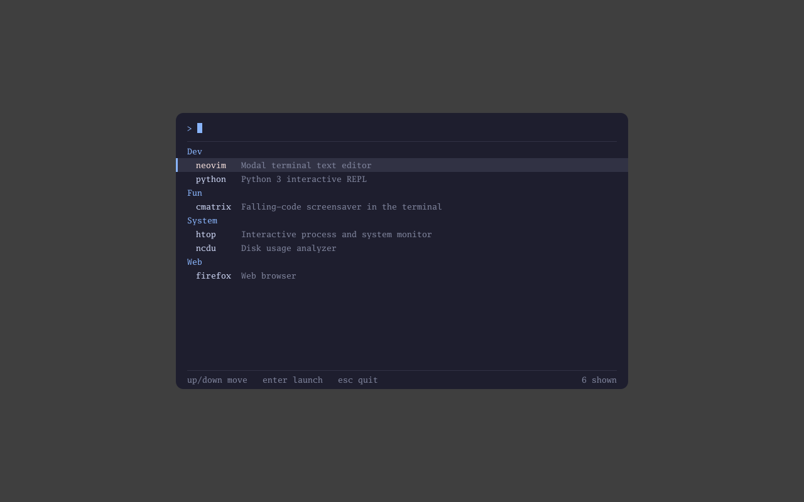

# Zinc

**Zinc** is a security-focused sandboxing core for Linux applications, using
rootless Podman containers or QEMU VMs. One authoring tool and two launchers share
canonical app schema v4; runtime adapters enforce the supported intent and
report unsupported combinations.

**Priority: Stable, then Secure, then Beautiful.**

- [Quickstart](docs/quickstart.md)
- [Architecture and focused references](docs/architecture.md)
- [Canonical examples](common/examples/README.md)
- [Contributing](CONTRIBUTING.md), [builds/checks](docs/build-and-checks.md)
- [Release history](CHANGELOG.md), [release plan](RELEASES.md), [roadmap](ROADMAP.md)

## Tools

| Short name | Tool | Role |
| --- | --- | --- |
| `zc` | `zinc-creator` | Author container/VM definitions; CLI and Bubbletea TUI |
| `zcr` | `zinc-container-runner` | Launch and manage containers |
| `zvr` | `zinc-virtualization-runner` | Launch and supervise VMs |
| `zlt` | `zinc-launcher-tui` | Terminal app picker |
| `zlg` | `zinc-launcher-gui` | Wayland layer-shell app picker |

The creator and launchers delegate to the runner selected by app `Type`; they
do not import runtime implementations. App YAML lives under
`$XDG_CONFIG_HOME/zinc/apps` (default `~/.config`). `LauncherMeta` holds picker
presentation. VM hardware/disk pins live in separate `runtime/vm/<app>.json`.
ZDE is a separate desktop-integration project built on this core.

## Current contracts and limits

- **Networking requires provisioning.** Empty `NetworkMeta.Interfaces` means
  no managed NIC. Declared NICs require owner-provisioned packet-preserving
  namespaces/TAPs and authoritative manifests. There is no automatic rootless
  pasta setup. Ordered `RulesByPriority` uses `From`/`To` peer types and endpoint
  filters, first-match/default-deny evaluation, and both app endpoints' consent.
- **Domains are frozen destination IP snapshots**, resolved through explicit
  DNS configuration. They are not hostname enforcement and do not distinguish
  names sharing an address. No host DNS fallback is allowed.
- **DNS supports UDP, TCP, TLS, HTTPS and QUIC in the shared adapter.** Local
  proxy routing needs explicit app permission and matching manifest digest.
  Both runners expose `dns-proxy` and authenticate its live configuration and
  listeners through the manifest's private [readiness socket](docs/dns.md).
- **Audio is directional and structured.** PipeWire grants require the host
  owner's opt-in deployment of the Zinc WirePlumber policy. Missing policy
  fails closed; no raw host audio socket fallback is provided. ALSA uses exact
  devices; PulseAudio-only clients need a separately restricted frontend.
- **Desktop access is bounded.** D-Bus is absent unless explicitly granted.
  Wayland contexts carry app identity, while compositor policy decides access.
  Use `RequireSecurityContext` to refuse raw-socket fallback. GPU access is
  opt-out with `DisableGpuAccess`, and has no VRAM cap.
- **VM support is host-side.** There is no guest agent, attached guest command
  execution or guest filesystem/bus bridge. Background graphical window-close
  persistence is unresolved and rejected. [VM limits](docs/virtualization.md)
  remain explicit rather than implied by shared field names.
- **Raw argv can override typed guarantees.** Nonempty `CreatorFlags` and
  `RunnerFlags` warn at authoring/planning/execution boundaries.

Existing files migrate only where intent can be represented losslessly;
conflicts and nonzero removed settings fail. See [migration](docs/migration.md).
Historical releases do not implement all contracts in this checkout.

## Build and use

Build commands use digest-pinned Go **1.26.6-alpine** through Podman. Current
common requires Go 1.26 and all consumers have refreshed module/vendor copies.
See [builds and exact pins](docs/build-and-checks.md) for the Podman and Nix paths.

```sh
make -C creator build
make -C container/runner build
make -C virtualization/runner build
make -C launcher/tui build
make -C launcher/gui build
```

Put the resulting `bin/zc`, `bin/zcr`, `bin/zvr`, `bin/zlt`, `bin/zlg` on PATH.
Runtime prerequisites are separate from compiling the binaries. Start offline:

```sh
zc init
zc validate example-shell
zc run example-shell            # managed plan
zc run example-shell --exec     # needs exact image locally and configured terminal
zc stop example-shell
zc tui
zlt                            # terminal picker
zlg                            # requires a layer-shell compositor
```

`zc validate APP --resolved` shows inherited intent. `zc image resolve IMAGE:TAG`
prints a digest pin; third-party images must be pinned and pulled separately.
The [quickstart](docs/quickstart.md) includes the offline image and terminal setup.



`make -C launcher/tui demo` and `make -C launcher/gui demo` select the bundled
offline fixtures without replacing real app definitions. The GUI fixture view
needs a suitable Wayland session. The reusable `menu` module also supplies
`make -C menu wallpaper-demo`.

## Development

The container runner uses ports and adapters: pure domain policy, port contracts,
application orchestration, concrete adapters and a composition root. Shared
`common/domain` types and `common/adapters` networking/audio/DNS mechanisms serve
both runtimes. [Components](docs/components.md) explains dependency direction.

Use module `make check` and tool `make build`; `make repro` checks repeatability.
Canonical example tests use strict decoding, with specific expected failures
for the deliberately broken fixture. Real Podman, VM, WirePlumber and DNS suites
have [documented prerequisites](docs/build-and-checks.md#examples-and-integration).
